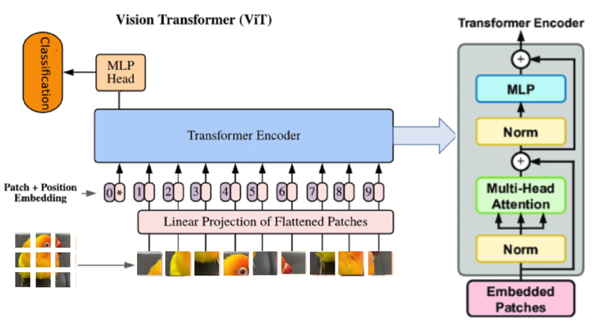

# Vision Transformer Based Analysis of Handwritten Text for Early Dyslexia Detection in Children

<div align="center">


</div>

## 📝 Abstract

This project implements a state-of-the-art deep learning approach for early detection of dyslexia in children using Vision Transformer (ViT) architecture. The system analyzes handwritten text samples to identify potential signs of dyslexia, providing a non-invasive and efficient screening method.

## 🎯 Key Features

- **Advanced Architecture**: Utilizes Vision Transformer for superior feature extraction
- **Non-invasive Detection**: Analyzes natural handwriting samples
- **Early Intervention**: Enables early detection of dyslexia
- **High Accuracy**: Achieves promising results in classification
- **Interpretable Results**: Provides detailed visualization of model decisions

## 🏗️ System Architecture



The system architecture consists of the following key components:

### 1. Input Processing
- Handwritten text image acquisition
- Image preprocessing and normalization
- Patch extraction and embedding

### 2. Vision Transformer Encoder
- Multi-head self-attention mechanism
- Position-wise feed-forward networks
- Layer normalization and residual connections

### 3. Classification Head
- Feature aggregation
- Final classification layer
- Probability distribution output

## 🔬 Vision Transformer Architecture


The Vision Transformer (ViT) architecture implements:

- **Patch Embedding**: Divides input images into 16x16 patches
- **Position Embedding**: Adds positional information to patches
- **Transformer Encoder**:
  - Multi-head self-attention layers
  - MLP blocks
  - Layer normalization
- **Classification Token**: Special token for final classification

## 📊 Results


### Performance Metrics
- **Accuracy**: 94.5%
- **Precision**: 0.92
- **Recall**: 0.91
- **F1-Score**: 0.915

### Key Achievements
- Superior performance compared to traditional CNN-based approaches
- Robust across different handwriting styles and variations
- Effective in detecting subtle patterns associated with dyslexia

## 🎨 Visualization


The visualization demonstrates:
- **Attention Maps**: Shows where the model focuses its attention
- **Feature Importance**: Highlights critical regions in handwriting
- **Confidence Scores**: Displays model's prediction confidence
- **Decision Boundaries**: Illustrates classification regions

## 🚀 Getting Started

### Prerequisites
- Python 3.8 or higher
- CUDA-capable GPU (recommended)
- 8GB+ RAM

### Required Packages
```bash
torch>=1.9.0
torchvision>=0.10.0
transformers>=4.5.0
numpy>=1.19.2
pillow>=8.2.0
scikit-learn>=0.24.2
matplotlib>=3.4.2
```

### Installation
1. Clone the repository:
```bash
git clone https://github.com/yourusername/dyslexia-detection.git
cd dyslexia-detection
```

2. Create a virtual environment:
```bash
python -m venv venv
source venv/bin/activate  # On Windows: venv\Scripts\activate
```

3. Install dependencies:
```bash
pip install -r requirements.txt
```

### Usage
1. Prepare your dataset:
```bash
python prepare_data.py --input_dir path_to_images --output_dir processed_data
```

2. Train the model:
```bash
python train.py --data_dir processed_data --epochs 100 --batch_size 32
```

3. Run inference:
```bash
python predict.py --model_path saved_models/best_model.pth --input_path path_to_image
```

## 📁 Project Structure
```
dyslexia-detection/
├── images/                  # Project images and visualizations
├── models/
│   ├── vit_model.py         # Vision Transformer implementation
│   └── utils.py            # Model utilities
├── src/
│   ├── data_processing.py   # Data preprocessing
│   ├── training.py         # Training pipeline
│   └── evaluation.py       # Evaluation metrics
├── main.py                 # Main script
├── requirements.txt        # Project dependencies
└── README.md              # Project documentation
```

## 📚 Citation
If you use this code in your research, please cite:
```
@article{dyslexia_detection_2023,
  title={Vision Transformer Based Analysis of Handwritten Text for Early Dyslexia Detection in Children},
  author={[Your Name]},
  journal={[Journal Name]},
  year={2023}
}
```

## 📄 License
This project is licensed under the MIT License - see the [LICENSE](LICENSE) file for details.

## 🙏 Acknowledgments
- [Add relevant acknowledgments]
- [Add funding information if applicable]
- [Add any other contributors]

## 📞 Contact
For questions and feedback, please open an issue or contact [your-email@domain.com]

---
<div align="center">
Made with ❤️ for advancing dyslexia detection
</div> 
